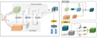

# CM3DV  

## A new 3d detection method name CM3DV
### Requirements
- CUDA >= 9.0
- Python 3.6.0
- An easy way to install the env, using const to install the requirements.txt. conda install --yes --file requirements.txt
- PyTorch >= 1.3.1
  - Note that, a very nice 3d tools to vis the detection result. [vispy](https://github.com/vispy)
   
### Usage:
1. To run the code, first need to add the path to the root folder. For example:
```
export PYTHONPATH=/xxx/CM3DV:$PYTHONPATH
export PYTHONPATH=/xxx/CM3DV/nuscenes-devkit/python-sdk:$PYTHONPATH
```
2. Data preparation (suppose we are now at the folder `CM3DV`):
   - Download the kitti and nuScenes data [kitti](http://www.cvlibs.net/datasets/kitti/raw_data.php), [nuScenes data](https://www.nuscenes.org/).
   - For nuScenes Example, Run command  
     `python data/create_data_with_ego_motion.py -r to/nuscenes/datasets -s train -p to/generate/nuScenesGenData`
     this will generate a new pkl named train_list.pkl and val_list.pkl in to/generate/nuScenesGenData.
3. Training model. 
   note that, this code have large number of CUDA operators. At present, this code only provide dynamic link so files for training.
   the other cuda source file will be open after receiving the paper
   ```python 
   python train_single_detect.py # all config file in configs.py
   ```
4. Visualization
   ```python 
   python vis/visDetectFull.py # vis detection result
   ```
5. For install ops separate
   ```shell
   cd ops/iou3d_nums
   python setup.py build_ext --inplace
   ```

## Files
- `train_single_detect.py` train the model and save pth file.
- `data dir` create dataset for CM3DV.
- `kitti` is the kitti relative dataset.
- `nuscenes-devkit` is the nuscenes relative dataset, nuScenes official API
- `ops dir` contains lager cuda custom operator. to be release the source code
- `utils dir` some utils function
- `config.py` model config to control the model super parameters
- `model.py` the main model file, for train the CM3DV model.

## Reference
```

@article{CM3DV,
    title={Cascaded Multi-3D-View Fusion for 3D Oriented Object Detection},
    author={Jing Sun and Jing Xu and Yimu Ji and Fei Wu and Yanfei Sun},
    journal={Submitted to Computers and Electrical Engineering},
    year={2022},
}
```
